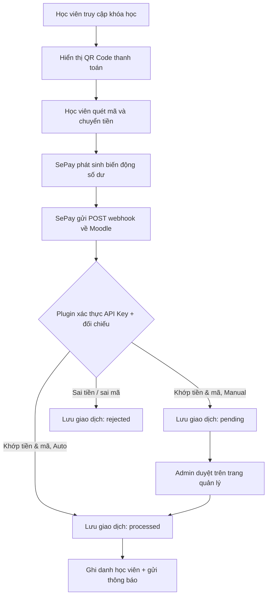

# SePay Enrolment Plugin cho Moodle (`enrol_sepay`)

[](https://github.com/MinhThang1009/sepay-plugin-moodle/actions/workflows/ci.yml)
[](https://www.gnu.org/licenses/gpl-3.0)


Plugin ghi danh (enrolment method) cho Moodle, tự động mở khóa học cho học viên ngay khi nhận
được chuyển khoản qua **SePay** — phù hợp với trường học, trung tâm bán khóa học và thu học phí
tự động qua chuyển khoản ngân hàng.

> **Luồng chính:** Học viên vào trang khóa học → thấy mã QR → chuyển khoản đúng số tiền + nội dung.
> SePay gửi webhook về Moodle → plugin đối chiếu → tự ghi danh (hoặc chờ admin duyệt nếu bật chế độ thủ công).

---

## Mục lục

- [Tính năng](#tính-năng)
- [Yêu cầu](#yêu-cầu)
- [Cài đặt](#cài-đặt)
- [Cấu hình](#cấu-hình)
- [Luồng xử lý](#luồng-xử-lý)
- [Ví dụ webhook](#ví-dụ-webhook)
- [Cấu trúc thư mục](#cấu-trúc-thư-mục)
- [Phát triển & CI](#phát-triển--ci)
- [Giấy phép](#giấy-phép)

## Tính năng

- 💳 **Ghi danh tự động** qua webhook SePay — không cần thao tác thủ công.
- ✅ **Chế độ duyệt thủ công** (tùy chọn theo từng instance hoặc toàn cục): admin xem & duyệt giao dịch.
- 🔐 **Xác thực webhook** bằng API Key (`hash_equals`), chống replay theo `transaction_ref`.
- 📊 **Trang quản lý giao dịch**: lọc theo trạng thái, tìm theo tên/khóa học, lọc theo chữ cái (hỗ trợ tiếng Việt), thao tác hàng loạt (duyệt/từ chối/hủy ghi danh/xóa), xuất CSV/Excel.
- ⏱️ **Tác vụ nền (cron)**: tự ghi danh giao dịch đã duyệt, xử lý hết hạn, gửi thông báo từ chối, dọn dữ liệu cũ, đồng bộ danh sách ngân hàng.
- 🔔 **Thông báo** qua chuông Moodle + email (chào mừng, từ chối, hủy ghi danh).
- 🌐 **Đa ngôn ngữ**: tiếng Việt + tiếng Anh.

## Yêu cầu

| Thành phần | Phiên bản |
|---|---|
| Moodle | 4.2 trở lên (`requires` = 2023042400) |
| PHP | 8.2+ |
| Database | MySQL / MariaDB / PostgreSQL (qua XMLDB của Moodle) |
| Dịch vụ ngoài | Tài khoản [SePay](https://sepay.vn) + webhook |

## Cài đặt

1. Đăng nhập Moodle bằng tài khoản `admin`.
2. Vào `Site administration` → `Plugins` → `Install plugins`.
3. Tải lên file `.zip` của plugin; đảm bảo loại plugin nhận diện là **Enrolment method (enrol)**.
4. Hoàn tất luồng cài đặt và chạy **Upgrade Moodle database now**.
5. Vào `Site administration` → `Plugins` → `Enrolments` → `Manage enrol plugins`, bật **SePay**.

Hoặc cài bằng Git (đặt vào thư mục `enrol/`):

```bash
git clone https://github.com/MinhThang1009/sepay-plugin-moodle.git enrol/sepay
```

## Cấu hình

### Thiết lập chung
`Site administration` → `Plugins` → `Enrolments` → `SePay`:

| Cài đặt | Mô tả |
|---|---|
| **Account** | Số tài khoản ngân hàng nhận thanh toán |
| **Bank** | Mã/tên ngân hàng nhận tiền |
| **Pattern** | Tiền tố mã thanh toán in trên QR (vd `SP`) |
| **API Key** | Khóa đối chiếu Moodle ↔ SePay (admin tự tạo, dán giống nhau ở cả 2 nơi) |
| **Manual Enrol** | Bật/tắt chế độ duyệt thủ công mặc định |

### Thiết lập webhook trên SePay
1. Vào https://my.sepay.vn/webhooks.
2. Thêm webhook URL: `https://<domain-moodle>/enrol/sepay/webhook.php`.
3. Kiểu xác thực: **API Key** (nhập đúng chuỗi đã đặt trong cấu hình plugin).

### Gán phương thức ghi danh vào khóa học
1. Vào tab `Participants` của khóa học → `Enrolment methods` → thêm **SePay**.
2. Nhập giá tại `Enrol cost`, chọn role, lưu.

### Cron
Plugin dựa vào cron của Moodle (chạy mỗi phút là lý tưởng):

```bash
# Linux / macOS
sudo -u www-data php admin/cli/cron.php
```

## Luồng xử lý



## Ví dụ webhook

Khóa học `id=10`, học viên `id=55`, pattern `SP` → nội dung chuyển khoản: **`SP10U55`**.

SePay gửi `POST` (JSON, rút gọn):

```json
{
  "gateway": "Vietcombank",
  "accountNumber": "0123456789",
  "transferType": "in",
  "transferAmount": 500000,
  "referenceCode": "FT2026...",
  "content": "Nguyen Van A ck SP10U55"
}
```

Plugin xử lý:
1. Xác thực header `Authorization: Apikey <key>`.
2. Parse `content` → khóa học `10`, học viên `55`.
3. Đối chiếu `transferAmount` với học phí của instance.
4. Khớp → lưu `processed` và ghi danh (auto), hoặc `pending` (chờ duyệt); sai → `rejected`.

## Cấu trúc thư mục

```text
enrol/sepay/
├── lib.php                  # Class enrol_sepay_plugin (core enrolment)
├── webhook.php              # Endpoint nhận POST từ SePay (xác thực + ghi danh)
├── complete_enrol.php       # Hoàn tất ghi danh sau countdown phía client
├── transactions.php         # Trang quản lý giao dịch (lọc/duyệt/xóa/xuất)
├── notification_settings.php# Trang dọn dẹp thông báo
├── download.php             # Xuất CSV/Excel
├── unenrolself.php          # Học viên tự hủy ghi danh
├── settings.php             # Cấu hình admin
├── locallib.php             # Bulk operations (sửa/hủy ghi danh hàng loạt)
├── classes/
│   ├── util.php             # Gửi thông báo/email, template HTML
│   ├── external.php         # Web service polling trạng thái (AJAX)
│   ├── observer.php         # Xử lý sự kiện hủy ghi danh
│   ├── table/               # Bảng giao dịch (table_sql)
│   └── task/                # Cron: process_enrolments, process_expirations,
│                            #       process_rejections, update_banks, cleanup_transactions
├── amd/src/                 # JS (AMD): QR, countdown, polling, bulk actions
├── db/                      # access, install.xml, upgrade, messages, tasks, services, events
├── lang/{en,vi}/            # Chuỗi ngôn ngữ
├── templates/               # Mustache (form QR)
└── cli/sync.php             # CLI đồng bộ
```

## Phát triển & CI

Repo dùng **GitHub Actions** với [`moodle-plugin-ci`](https://moodlehq.github.io/moodle-plugin-ci/)
(Moodle 4.2 + PHP 8.2 + MariaDB) — xem [`.github/workflows/ci.yml`](.github/workflows/ci.yml).

Mỗi push/PR tự chạy: `phplint`, `validate`, `savepoints`, `mustache`, `phpunit`, `behat`
(gate cứng) và `phpcs`, `phpmd`, `phpstan`, `grunt` (advisory).

Chạy kiểm tra local (cần PHP + [moodle-plugin-ci](https://moodlehq.github.io/moodle-plugin-ci/)):

```bash
moodle-plugin-ci phplint
moodle-plugin-ci phpcs
moodle-plugin-ci phpstan
```

## Giấy phép

[GNU GPL v3 or later](https://www.gnu.org/licenses/gpl-3.0) — theo chuẩn plugin Moodle.
